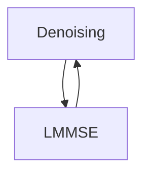

$$\sum\limits_{i=0}^n i^2$$

## Table of contents

In this Wiki page we give a short tutorial on:

**1. downloading gVAMP code from Git repository** <br />
**2. compiling gVAMP code in the HPC (High-Performance Computing) environment** <br />
**3. inferring effect in the Bayesian linear model** <br />
**4. calculation of marker p-values using Leave-on-out (LOO) or Leave-One-Chromosome-Out (LOCO) method** <br />
**5. obtaining out-of-sample prediction accuracy** <br />
**6. Running gVAMP on the DNAnexus platform using Docker** <br />

## 0. About gVAMP: Inference under Bayesian Linear model with Spike-and-Slab mixture of Gaussians prior

Bayesian linear regression is the most widely used model interpretable model for high-dimensional inference in life sciences, and it allows for information on the signal structure to be incorporated in the inference process. We wish to estimate the high-dimensional 
signal vector $$\mathbf{\beta}\in \mathbb{R}^P$$ from a vector of phenotype measurements $\mathbf{y} \in \mathbb{R}^N$ given by the following linear relationship: 
\Large y_i = \langle \mathbf{x}_i, \mathbf{\beta}  \rangle + \epsilon_i, \quad  \text{ for } i\in \{1,  \ldots, N\}. 


Here, $\mathbf{x}_i$ is a row vector of the normalized genotype matrix $\mathbf{X}$, $`\langle \mathbf{x}_i, \mathbf{\beta}  \rangle = \mathbf{x}_i^T \mathbf{\beta}`$ denotes the Euclidean inner product, and $\mathbf{\epsilon} = (\epsilon_1, \ldots, \epsilon_N)$ is an unknown noise vector that is assumed to follow the multivariate normal distribution 
$$\Large \mathbf{\epsilon} \sim \mathcal N(0, \gamma_{\epsilon}^{-1} \cdot {\mathbf{I}}_N)$$ 

with unknown noise precision parameter $\gamma_{\epsilon}^{-1}$. To allow for a range of genetic effects, from heavy-tail distributions to sparse ones, we model the prior on the signal $\mathbf{\beta}$ to be of a spike-and-slab form. Namely, for $i=1, \dots, P$, we use mixture of Gaussian distributions to model the slab component. Namely, 

$$\Large\beta_i \sim (1-\lambda) \cdot \delta_0(\cdot) + \lambda \cdot \sum^{L}_{i=1} \pi_i \cdot \mathcal{N}(\cdot, 0, \sigma_i^2).$$

The gVAMP is an iterative procedure consisting of two steps: (i) denoising, and (ii) linear minimum mean square error estimation (LMMSE). The denoising step accounts for the prior structure given a noisy estimate of the signal $\mathbf{\beta}$, while the LMMSE step utilizes phenotype values to further refine the estimate. The key feature of EM-VAMP is in the so called _Onsager correction_: this is added to ensure the asymptotic normality of the noise corrupting the estimates of $\mathbf{\beta}$ given by the algorithm at every iteration. This property then -- together with an estimate of noise precision also obtained from the algorithm -- allows a precise performance analysis via _state evolution_ and, consequently, the optimization of the denoisers. Schematically, the inference procedure can be summarized as follows:



## 1. Downloading gVAMP code from Git repository

To download the git repository one can simple use _git clone_ command. After entering the following command in the command line

`git clone https://github.com/medical-genomics-group/gVAMP.git`

the latest version of source code of gVAMP will be downloaded in your current directory.

## 2. Compiling gVAMP code in the HPC (High-Performance Computing) environment

gVAMP uses boost and openmpi libraries. Additionally, one needs _gcc_ library for compilation of the code. Here is an example of the code that loads modules _gcc_, _openmpi_ and _boost_ and compiles the gVAMP source code into an executable stored in _loc_ and named _main_real.exe_.

```

module purge

module load gcc openmpi boost

module list 

loc={a path to cpp_vamp folder}


mpic++ /$loc/main_real.cpp /$loc/vamp.cpp /$loc/utilities.cpp /$loc/data.cpp /$loc/options.cpp -march=native -DMANVECT -Ofast -g -fopenmp -lstdc++fs -D_GLIBCXX_DEBUG -o  /$loc/main_real.exe

```

## 3. Inferring genetic effects under a Bayesian linear model

We provide an example of a SLURM script that request resources and run the gVAMP. Each bash script must start with _#!/bin/bash_. The script below requests 30 workers with 2 CPUs each and 5GB of memory per CPU.

```
#!/bin/bash

#SBATCH --job-name=EOSI1
#SBATCH --time=02-00:00:00
#SBATCH --mem-per-cpu=5gb
#SBATCH --ntasks=30
#SBATCH --cpus-per-task=2
#SBATCH --output={location and name of the log file connected to your run}.log

module purge
ml boost openmpi
module list 

export OMP_NUM_THREADS=$SLURM_CPUS_PER_TASK

# printing out the details of the job
out_dir={absolute path to the directory in which one wants the output to be written in}
phen_file_loc={absolute path to the .phen file which contains phenotype values}
bed_file_loc={absolute path to the .bed file}

bed_name={name of the bed file, ex. 'ukb22828_UKB_EST_v3_ldp08_fd_EOSI_train'}
phen_name={name of the file containing phenotypes, ex. 'ukb22828_UKB_EST_v3_ldp08_fd_EOSI_train'}

echo "bed_name = " ${bed_name} 
echo "phen_name = " ${phen_name} 


# Specifying the total number of markers in the model (Mt)
Mt=2174071 

vloc={absolute path to the folder that contains .exe file obtained from compiling the code in the previous step}

time mpirun -np 30 $vloc/main_real.exe --bed-file ${bed_file_loc}/${bed_name}.bed \
                                --phen-files ${phen_file_loc}/${phen_name}.phen \
                                --N 401452 \
                                --Mt ${Mt} \
                                --out-dir ${out_dir} \
                                --out-name x1_hat_EOSI_${bed_name}_G1 \
                                --iterations 35 \
                                --num-mix-comp 23 \
                                --CG-max-iter 100 \
                                --probs 9.700000000000e-01,1.500000357658e-02,7.500001788289e-03,3.750000894144e-03,1.875000447072e-03,9.375002235361e-04,4.687501117680e-04,2.343750558840e-04,1.171875279420e-04,5.859376397100e-05,2.929688198550e-05,1.464844099275e-05,7.324219246375e-06,3.662110873188e-06,1.831055186594e-06,9.155274682969e-07,4.577638591485e-07,2.288818795742e-07,1.144409522871e-07,5.722046364356e-08,2.861023182178e-08,1.430511841089e-08,7.152559205445e-09 \
                                --vars 0,0.0000001,0.0000002238,0.0000005,0.00000112,0.00000251,0.00000561,0.000012565,0.00002812,0.0000629,0.0001408448,0.0003152106,0.0007054413,0.001578778,0.001578778,0.003533305,0.007907536,0.01769706,0.03960603,0.0886383,0.1983725,0.4439577,0.9935773 \
                                --model linear \
                                --run-mode infere \
                                --store-pvals 0 \
                                --learn-vars 1 \
                                --rho 0.1
```


### 3.1. Currently supported options
We proceed with a list of currently supported input options to the software:

| Input option | Description |
| --- | --- |
| `run-mode` | 'infere' / 'test' / 'both' |
| `bim-file` | filepath to .bim file including the .bim extension |
| `bed-file` | filepath to .bed file including the .bed extension |
| `bed-file-test` | filepath to .bed file reserved for testing purposes |
| `phen-files` | path to file containing phenotype of interest (only 1 phenotype supportet at the moment) |
| `phen-files-test` | path to phenotype file reserved for testing purposes |
| `cov-file` | filepath to .cov file including the .cov extension (covariates in a probit model) |
| `N` | number of individuals included in the inference process |
| `N-test` | number of individuals included in a testing dataset |
| `Mt-test` | total number of markers included in a testing dataset |
| `Mt` | total number of markers included in the infrence process |
| `out-dir` | output directory for the signal estimates |
| `out-name` | name of the output file |
| `iterations` | maximal number of iterations to be performed |
| `num-mix-comp` | number of gaussian mixture components used (including delta spike at zero) |
| `CG-max-iter` | maximal number of iteration used in conjugate gradient method for solving linear systems |
| `probs` | initial prior mixture coefficients (separated by comma, must sum up to 1) |
| `vars` | initial prior variances (separated by comma) |
| `rho` | initial value of damping factor |
| `EM-err-thr` | relative error threshold within expectation maximization |
| `EM-max-iter` | maximal number of iterations of expectation maximization procedure |
| `stop-criteria-thr` | relative error threshold within expectation maximization |
| `model` | regression model that describes a relationship between effect sizes and phenotypes ('linear' or 'bin_class') |
| `store-pvals` | indicates wheather or not the algorithm stores p-values from association tests of each of the markers |
| `test-iter-range` | indicates the iteration range for which R2 on a test set is calculated |
| `h2` | heritability value used in simulations  |
| `CV` | number of causal variants used in simulations |
| `true_signal_file` | path to file containing true value of the signal |
| `alpha` | scaling factor applied in the normalization of a genotype matrix |
| `learn-vars` | indicates wheather or not prior variances are learnt |
| `alpha-scale` | columns of genotype matrix are scaled with std^(-alpha-scale) |
| `gam1-init` | initial value of gam1 in the restart scenario |
| `gamw-init` | initial value of gamw in the restart scenario |
| `init-est` | indicates whether or not we initialze gVAMP with an estimate provided in estimate-file |
| `seed` | defines a seed for the gVAMP run (must be a non-negative integer) |


### 3.2. Input formats
Given that there are many formats in which the input data can be stored we finish this subsection by precisely describing the format of the input files:
1. --bed-file requires an absolute path to genotype data stored in PLINK format (https://www.cog-genomics.org/plink/2.0/)
2. --phen-files requires an absolute path to a .phen file which does NOT contain header and has the following structure:

<div align="center">

| IID | FID | phenotypic_value | 
| --- | --- | --- | 
...

</div>

## 4. Calculation of marker p-values using LOO or LOCO method

We provide an example of a SLURM script that runs gVAMP for the purpose of calculating marker p-values using Leave-One-Out (LOO) and/or Leave-One-Chromosome-Out (LOCO) method. The software calculates the p-values using LOO and/or LOCO method depending on the value of the _store_pvals_ parameter that is passed as an input option. If _store_pvals_ = 0 (default value), then the code runs both LOO and LOCO-based p-value calculations. If its value is set to 1, then only LOO is run and if it is set to 2, then only LOCO is run.

```
#!/bin/bash
 
#SBATCH --job-name=run_VAMP_EOSI_217_pvals
#SBATCH --time=0-11:45:00
#SBATCH --mem-per-cpu 8gb
#SBATCH --ntasks 26
#SBATCH --cpus-per-task 2
#SBATCH --output=VAMP_EOSI_217_pvals.log

module purge
ml openmpi boost
module list 

export OMP_NUM_THREADS=$SLURM_CPUS_PER_TASK

# printing out the details of the job
out_dir={absolute path to the directory in which one wants the output to be written in}
phen_file_loc={absolute path to the .phen file which contains phenotype values}
bed_file_loc={absolute path to the .bed file}

bed_name={name of the bed file, ex. 'ukb22828_UKB_EST_v3_ldp08_fd_EOSI_train'}
phen_name={name of the file containing phenotypes, ex. 'ukb22828_UKB_EST_v3_ldp08_fd_EOSI_train'}

echo "bed_name = " ${bed_name} 
echo "phen_name = " ${phen_name} 

# Specifying the total number of markers in the model (Mt)
Mt=2174071 

vloc={absolute path to the folder that contains .exe file obtained from compiling the code in the previous step}

time mpirun -np 26 $vloc/main_real.exe --bed-file  ${bed_file_loc}/${bed_name}.bed \
				--bim-file  ${bed_file_loc}/${bed_name}.bim \
                                --phen-files ${phen_file_loc}/${phen_name}.phen \
                                --Mt ${Mt} \
                                --N 401452 \
                                --estimate-file {absolute path to .bin estimate file} \
                                --run-mode pvals-calc \
                                --out-dir ${out_dir} \
                                --out-name EOSI_217_pvals_it22

```

## 5. Obtaining out-of-sample prediction accuracy
We provide an example of a SLURM script that runs gVAMP for the purpose of calculating out-of-sample prediction accuracy.

```
#!/bin/bash

#SBATCH --job-name=EOSIt
#SBATCH --time=0-03:20:00
#SBATCH --mem 20gb
#SBATCH --ntasks 2
#SBATCH --cpus-per-task 2
#SBATCH --output=VAMP_217_EOSI_test.log

module purge
ml boost openmpi
module list 

export OMP_NUM_THREADS=$SLURM_CPUS_PER_TASK

# printing out the details of the job
out_dir={absolute path to the directory in which one wants the output to be written in}
phen_file_loc={absolute path to the .phen file which contains phenotype values}
bed_file_loc={absolute path to the .bed file}

bed_name={name of the bed file, ex. 'ukb22828_UKB_EST_v3_ldp08_fd_EOSI_test'}
phen_name={name of the file containing phenotypes, ex. 'ukb22828_UKB_EST_v3_ldp08_fd_EOSI_test'}

echo "bed_name = " ${bed_name} 
echo "phen_name = " ${phen_name} 

# Specifying the total number of markers in the model (Mt)
Mt=2174071 

vloc={absolute path to the folder that contains .exe file obtained from compiling the code in the previous step}

time mpirun -np 2 $vloc/main_real.exe --bed-file-test  ${bed_file_loc}/${bed_name}.bed \
                                --phen-files-test ${phen_loc}/${phen_name}.phen \
                                --N-test 15000 \
                                --Mt-test 2174071 \
				--test-iter-range 1,35 \
                                --estimate-file {absolute path to .bin estimate file} \
                                --run-mode test
```


## 6. Running gVAMP on the DNAnexus platform using Docker

First, clone the repository to the local workspace:
```
git clone https://github.com/medical-genomics-group/gVAMP.git
```
Change the working directory:
```
cd gVAMP
```
Modify ``run_gvamp.sh`` script (see below for more detailed explanation) and set paths to your data. In the run time, the data directory can be mounted to a specific location in the container.

Then, build docker image:
```
docker build -t gvamp 
```
Finnaly, run docker application in detached mode (``-d``). ``-v`` allows mounting local data to your container. Note, that you can specify arbitrary mounted directory instead of ``/home/mnt``, but this has to be consistent with the paths specified in ``run_gvamp.sh``.
```
docker run -d -v {local data directory}:/home/mnt gvamp:latest
```
By default, the output logs will show in ``{local data directory}/output/gvamp.log``.


Here is a Dockerfile declaration that can be used for running gVAMP on the DNAnexus:

```
FROM ubuntu
RUN ln -snf /usr/share/zoneinfo/Europe/London /etc/localtime && echo Europe/London > /etc/timezone && \
    apt-get update --yes && \ 
    apt-get install build-essential --yes --no-install-recommends && \
    apt install mpich --yes --no-install-recommends && \
    apt install libboost-all-dev --yes --no-install-recommends && \
    apt install git-all --yes --no-install-recommends
RUN git clone https://github.com/medical-genomics-group/gVAMP.git
RUN mpic++ ./gVAMP/main_real.cpp ./gVAMP/vamp.cpp ./gVAMP/utilities.cpp ./gVAMP/data.cpp ./gVAMP/options.cpp -march=native -DMANVECT -Ofast -g -fopenmp -lstdc++fs -D_GLIBCXX_DEBUG -o  ./gVAMP/main_real.exe
COPY run_gvamp.sh /gVAMP/run_gvamp.sh
WORKDIR /gVAMP
CMD sh run_gvamp.sh
```

where run_gvamp.sh contains:

```
# Set data directory
DATA_DIR=/home/mnt
OUT_DIR=/home/mnt/output

# Create output folder in data directory.
mkdir ${OUT_DIR}

# Set parallelization according to available CPU resources
NUM_MPI_WORKERS=...
NUM_OMP_THREADS=...

export OMP_NUM_THREADS=${NUM_OMP_THREADS}
mpirun -np ${NUM_MPI_WORKERS} --allow-run-as-root main_real.exe \
	--model linear \
	--run-mode infere \
	--bim-file ${DATA_DIR}/... \
	--bed-file ${DATA_DIR}/... \
	--phen-files ${DATA_DIR}/... \
	--N ... \
	--Mt ... \
	--out-dir ${OUT_DIR}/ \
	--out-name ... \
	--iterations ... \
	--num-mix-comp ... \
	--probs ... \
	--vars ... \
	--rho ... \
> ${OUT_DIR}/gvamp.log
```

